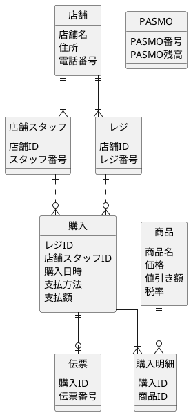

# セブン - イレブンレシート

---

## 所感

- 税率が気持ち悪い
  - 今後変更されるはず
- 支払い方法が気持ち悪い
  - pasmo支払い以外にも、現金やクレカなどがあるはず
  - 必要なデータはもっと多いと思う
  - 現金支払い時のお釣り計算などもあった方が良いと思う
- 値引き額が気持ち悪い
  - 店舗によって、時期によって、値引きのロジックは変更されると思う
  - データは商品に持つべきではないきがする
